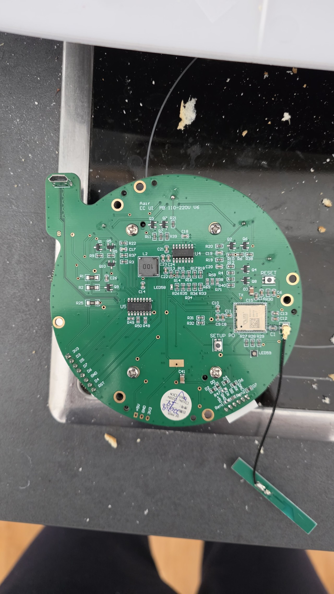
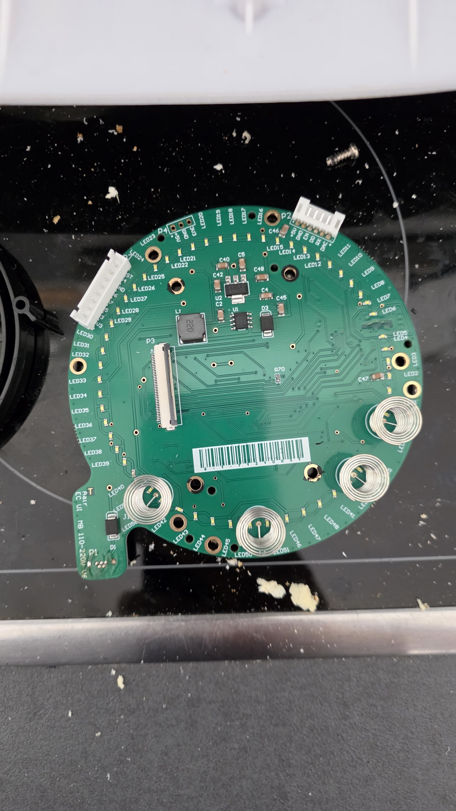

# Aeris AAIR Components and Available Interfaces

This document summarizes the MCU and peripheral components currently used by the firmware (Photon target), with additional teardown notes for reference.  
Date: 2026-02-22

## 1. MCU and System Layer

### 1.1 Main MCU
- Model / platform: `Particle Photon` (firmware compile target: `photon`)
- Firmware runtime mode:
  - `SYSTEM_MODE(SEMI_AUTOMATIC)`
  - `SYSTEM_THREAD(ENABLED)`
- Boot behavior:
  - SoftAP prefix: `Aeris`
  - SoftAP page handler registered: `WebConfigServer::softApHandler`

### 1.2 System Interfaces Available at MCU Layer
- Wi-Fi:
  - `WifiManager::beginSetupMode()` enables `WiFi.listen()` (SoftAP)
  - `WifiManager::beginNormalMode()` sets STA credentials and calls `WiFi.connect()`
- EEPROM:
  - `SettingsStore` reads/writes `SettingsV2` (with CRC32 validation/default/sanitize)
- System control:
  - `System.reset()` (reboot)
  - `System.dfu(false)` (enter DFU mode)
- Diagnostics:
  - `Serial.begin(9600)` (debug serial)
  - `RGB.control(true)` + `RGB.color(...)` (status LED)

## 2. Firmware-Used Peripheral Components (Code-Based)

### 2.1 Fan Driver
- Module: `FanDriver`
- Pin: `D0`
- Hardware interface: `GPIO PWM` (`analogWrite`)
- Supported operation:
  - `setPercent(0..100)`: clamps to valid range and maps to PWM `0..255`
- Upstream control sources:
  - Buttons (`+/-5` adjustment)
  - MQTT `cmd/fan_percent`
  - Internal power toggle logic

### 2.2 Display and Lighting
- Module: `DisplayDriver`
- Display chipset/library: `ST7789` (`Adafruit_ST7735_RK` / `Adafruit_ST7789`)
- Pins:
  - TFT: `CS=A2`, `DC=A0`, `RST=-1`
  - TFT SPI data/clock: `MOSI`, `SCK` (hardware SPI; firmware limits to 8 MHz)
  - Backlight: `A1`
  - `D6`: display-related helper control line (set `OUTPUT LOW` at boot to avoid floating)
- Hardware interfaces:
  - `SPI` (TFT)
  - `GPIO` (backlight)
- Supported operations:
  - `renderSetupScreen()` (Wi-Fi setup guidance)
  - `renderConnectingScreen()` (connecting screen)
  - `render(state, settings)` (shows fan % and PM2.5)
  - `setLights(bool)` (backlight)

### 2.3 Button Inputs (4 keys)
- Module: `ButtonDriver`
- Pins: `D1`, `D2`, `D3`, `D4`
- Hardware interface: `GPIO input pulldown`
- Software handling:
  - debounce: `40ms`
  - command triggered on `LOW -> HIGH` only
- Supported operation interface (button to command mapping):
  - `D1`: `AdjustFanPercent +5`
  - `D2`: `AdjustFanPercent -5`
  - `D3`: short press `ToggleLights`; long press (>=5s) `ToggleWifi`
  - `D4`: short press `TogglePower`; long press (>=8s) `ResetWifiSettings` (clear saved Wi-Fi and reboot)

### 2.4 PM Sensor
- Module: `SensorDriver`
- Pins:
  - Sensor TX control pin: `A6` (bit-bang output for wake command)
  - Data receive: `Serial1` (9600)
- Hardware interfaces:
  - `UART` (`Serial1`)
  - `GPIO bit-bang` to send wake/start command
- Protocol characteristics (current implementation):
  - Parses 32-byte frames, header `0x32 0x3D`
  - Checksum: sum first 30 bytes and compare against the last 2 bytes
  - Extracted fields: `pm25_raw`, `pm10_raw`
  - If no data for 10 seconds (watchdog), sends 3 wake command groups in sequence

## 3. Communication and Control Interfaces (External)

### 3.1 MQTT Interface
- Module: `MqttClient`
- Broker settings source: `SettingsV2` (`mqtt_host/mqtt_port/mqtt_user/mqtt_pass/device_id`)
- Topic root: `aeris/v2/<device_id>`
- Subscriptions (control):
  - `aeris/v2/<device_id>/cmd/fan_percent` (payload `0..100`)
  - `aeris/v2/<device_id>/cmd/lights` (payload `0|1`)
  - `aeris/v2/<device_id>/cmd/screen_light` (payload `0|1`, A1 backlight only)
- Publishes (state):
  - `state/fan_percent`
  - `state/fan_pwm`
  - `state/lights`
  - `sensor/pm25`
  - `sensor/pm10`
  - `health/uptime_s`
  - `health/wifi_reconnect_count`
  - `health/mqtt_reconnect_count`
  - `health/sensor_parse_errors`

### 3.2 Local Web API (LAN)
- Module: `WebConfigServer`
- Service port: `80`
- Endpoints:
  - `GET /` (built-in web UI dashboard)
  - `GET /api/v2/settings`
  - `POST /api/v2/settings` (`x-www-form-urlencoded`)
  - `GET /api/v2/state`
  - `POST /api/v2/control` (`x-www-form-urlencoded`)
  - `POST /api/v2/system/reboot`
  - `POST /api/v2/system/dfu`
- Key response fields in `GET /api/v2/state`: `fan_percent`, `lights_on`, `screen_light_on`, `pm25`, `pm10`, `wifi_ready`, `mqtt_connected`
- Settings fields (POST):
  - Network: `wifi_ssid`, `wifi_pass`
  - MQTT: `mqtt_host`, `mqtt_port`, `mqtt_user`, `mqtt_pass`, `device_id`
  - UI: `fan_font_size`, `fan_x`, `fan_y`, `pm_font_size`, `pm_x`, `pm_y`,
    `fan_color`, `pm_label_color`, `pm_value_color`

### 3.3 SoftAP Setup Interface
- Entry: Photon listening mode + `softap_http`
- Page handler: `WebConfigServer::softApHandler`
- Basic flow:
  - `GET /save?s=<ssid>&p=<pass>` stores Wi-Fi credentials and sends reboot command
  - Without query parameters, returns a simple HTML form page

## 4. Current Pin Mapping (Firmware v2)

| Function | Pin | Interface Type | Module |
|---|---|---|---|
| Fan output | `D0` | PWM/GPIO | `FanDriver` |
| Button UP | `D1` | GPIO in | `ButtonDriver` |
| Button DOWN | `D2` | GPIO in | `ButtonDriver` |
| Button EXTRA | `D3` | GPIO in | `ButtonDriver` |
| Button POWER | `D4` | GPIO in | `ButtonDriver` |
| Display helper control | `D6` | GPIO out | `AppController` |
| TFT DC | `A0` | SPI control pin | `DisplayDriver` |
| TFT backlight | `A1` | GPIO out | `DisplayDriver` |
| TFT CS | `A2` | SPI control pin | `DisplayDriver` |
| TFT MOSI | `MOSI` | SPI data | `DisplayDriver` |
| TFT SCK | `SCK` | SPI clock | `DisplayDriver` |
| Sensor TX control | `A6` | GPIO out (bit-bang) | `SensorDriver` |
| Sensor data stream | `Serial1` | UART | `SensorDriver` |

## 5. Teardown References (External, Needs Hardware Confirmation)

Reference source:  
`https://gist.github.com/martinszelcel/0afaadd5701700c9c62d966b6a8ecd08`

Components mentioned in the teardown notes (summary):
- Mainboard MCU: `Silan SC92F8623B`
- Top control board: `P0A-01 V1.0`, with `CY8CKIT-059` (PSoC 5LP)
- Display: 2.4" TFT, controller `ST7789` (older notes mentioned `ILI9341`)
- Fan driver IC: `JY01`
- Particulate sensor: Honeywell series (mentions `HPMA115S0`)

Notes:
- These teardown details are external observations and do not necessarily represent all targets directly controlled by this firmware.
- Based on the current code in this repo, the control target is `Particle Photon`, and it directly uses TFT, buttons, fan PWM, and PM sensor UART.

## 6. First-Party Teardown: EC_UI Board

Photographed on a powered spare unit, 2026-09-04. Unlike section 5 these are observations of
our own hardware, so treat them as confirmed unless a row says otherwise.

Stripped down 2026-09-06, both sides:

### 6.1 Board identity

Silkscreen on the round board reads `Aair EC UI MB 110-220V V6`. The 2026-09-04 photograph
had the tail obscured by a reflector; the 2026-09-06 strip-down settles it. One board carries
both the user interface and the Particle section, so the section 5 gist's separate "top
control board" does not describe this revision. A QC sticker on the back is ticked `220V`
`EU`. The TFT is marked `FLR-T156-V0` / `JS24013D-2` / `2022/05/03`.

### 6.2 What is on it

- **LED ring.** A dense perimeter ring of small white emitters with sequential designators
  running to at least `LED57`, all lit uniformly.
- **Four lens LEDs.** Large collimator-style emitters spaced around the ring. The ring and
  these four are separate populations on one board, which matters because the key-light
  shift-register driver addresses the four, not the ring: walking the register bit by bit on
  a running unit lights the four buttons in pairs (0x03 power, 0x0C AirQ, 0x30 down, 0xC0 up)
  and never a ring segment.
  Both populations are lit in the photo above, which is stock behaviour. What is NOT yet
  explained is why the perimeter ring stays dark under this firmware when no register bit
  addresses it — most likely the `A4` line the driver pulses at boot and then releases to
  `INPUT` gates it. Anyone wanting the ring as an indicator should start there.
- **Display.** A TFT in a metal bezel, connected by flex ribbon to a small secondary PCB
  rather than to the harness directly. It shows the `aair` wordmark with a three-dot
  animation while booting. That is stock behaviour, and a useful sign the panel is alive
  before any reflash.
- **Front-panel controls.** Two round pads and a small circular aperture sit in the black
  chassis behind the board.

### 6.3 Harness connector

A six-way JST-style header carries the black harness. The silkscreen beside it reads `5V`,
`GND`, `D0`, `RX`, `TX` and `DAC`. The pin *names* are legible; the pin *order* is not
readable at this angle and must be confirmed against the board before wiring anything.

Those names line up with the firmware pin table in section 4, which is the first direct
evidence that this harness is the Photon interface rather than an internal bus:

| Silkscreen | Firmware use | Confidence |
|---|---|---|
| `5V`, `GND` | supply | observed |
| `D0` | fan PWM, `FanDriver` | matches section 4 |
| `RX`, `TX` | `Serial1`, PM sensor UART, `SensorDriver` | matches section 4 |
| `DAC` | probably the `A6` sensor wake line | inferred, unverified |

The bare-board photograph shows the same six names on header `P2` in the order `+5V`, `GND`,
`EN`, `DO`, `RX`, `DAC`, so the order question in section 7 is answered by silkscreen: the
harness `D0` is `DO` on the board and sits fourth, and there is an `EN` pin the earlier
photograph missed.

The `DAC` row rests on Particle's pin aliasing, where `A6` is also `DAC2`. It is not a
measurement. Confirm it before relying on it.

### 6.4 Particle section and the two buttons

The back of the board is the Particle half. It carries a micro-USB jack, a USI radio module
(`U9`, marked `BM-09` — the module Particle uses in the Photon family) with a u.FL pigtail to
a strip antenna, and two tact switches silkscreened `RESET` and `SETUP`. Two rows of pads
break out Particle net names: `3V3`, `RST`, `GND`, `D0`-`D7`, `DAC`, `RX`, `TX`, `+5V`, `EN`.
The device enumerates as a Photon (`2b04:c006` running, `2b04:d006` in DFU), which is what the
flashing procedure in the README already relies on.

So the buttons are the standard Particle pair, handled by Device OS rather than by this
application:

| Action | Result |
|---|---|
| Tap `RESET` | reboot |
| Hold `SETUP` ~3 s, LED blinks dark blue | listening mode, the serial provisioning entry point |
| Hold `SETUP` ~10 s longer, LED blinks blue rapidly | network reset, erases stored Wi-Fi credentials |
| Hold `SETUP`, tap `RESET`, release at blinking magenta | safe mode, Device OS boots without this application |
| Hold `SETUP`, tap `RESET`, release at blinking yellow | DFU mode |
| Hold `SETUP`, tap `RESET`, hold past yellow to white | factory reset — do not use, see below |

The yellow release matters for recovery: it reaches DFU with no working application and no
`stty -F /dev/ttyACM0 14400`, so a unit whose firmware hangs is still flashable, including from
the browser flasher. Prefer it over the baud-rate trick whenever the board is accessible.

Do not release at white. Factory reset restores the Photon's factory backup image, which on an
OEM unit is not our application and is not a known-good state.

## 7. Recommended Next Steps

- Settle the `DAC` to `A6` question in section 6.3 with a meter rather than another photograph.
- Use an oscilloscope or logic analyzer to verify the actual sensor model and command set behind `A6` and `Serial1`.
- Add a wiring diagram showing physical connections between `Particle Photon` and the original board MCU(s) if it is a dual-MCU architecture.
- Keep this document synchronized with `docs/interfaces.md` whenever topics/API are changed.
